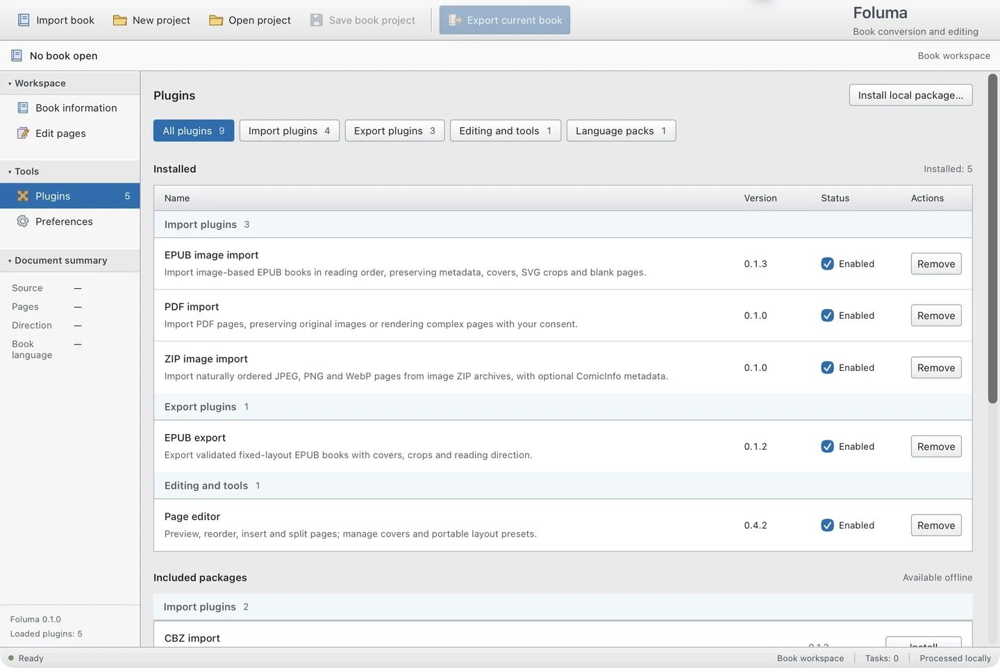

<p align="center">
  
</p>

<h1 align="center">Foluma</h1>

<p align="center">A local workspace for books and pages.</p>

<p align="center">
  <a href="docs/USER-GUIDE.md">User guide</a> ·
  <a href="docs/DEVELOPMENT.md">Development</a> ·
  <a href="docs/PLUGIN-API.md">Plugin API</a> ·
  <a href="LICENSE">MIT license</a>
</p>

Foluma helps you turn image-based books into a reading experience that fits. Organize a collection, arrange pages and facing spreads, then export individual books or an entire series. Your books and edits stay on your computer.


## What you can do

- **Organize a series.** Keep books, groups, metadata and review progress in a portable project folder.
- **Edit pages visually.** Reorder pages, split spreads, insert blanks, manage covers, and undo changes.
- **Check facing pages.** Preview spreads in either reading direction and simulate a reader's leading blank without changing the exported book.
- **Preserve image quality.** Extract supported PDF images directly; render complex pages to PNG using Auto resolution during project preparsing.
- **Export in batches.** Use each book's saved layout or a reusable preset, with separate results and protection for existing files.
- **Choose your tools.** Importers, exporters, the page editor and language packs are independent plugins. English and Traditional Chinese are available.

## Formats

| Format | Import | Export |
| --- | --- | --- |
| PDF | Image extraction with optional rendering | Image-based PDF |
| EPUB | Supported image-page layouts | Fixed-layout EPUB, with general and two-page optimized editions |
| CBZ | Images and ComicInfo metadata | Images and ComicInfo metadata |
| ZIP | JPEG, PNG and WebP image archives | — |

PDF import, EPUB export and the page editor install automatically on first launch. Other format plugins and Traditional Chinese are included as optional offline packages under **Plugins → Included packages**. Import and export plugins can be enabled or removed independently.

<details>
<summary>Plugin management</summary>



</details>

EPUB import supports image books, not arbitrary reflowable or scripted publications. PDF export retains full source images behind crops; use a redaction tool to remove sensitive content. See the [user guide](docs/USER-GUIDE.md) for format limits and image handling.

## Getting started

Foluma **0.1.0** is available for **macOS Apple Silicon**. Download the disk image or app archive from the [latest release](https://github.com/0xH4KU/foluma/releases/latest), open it, and move **Foluma.app** to **Applications**. The packaged app includes its engine and plugins, so end users do not need Python, Node.js or Rust. You can also [build from source](docs/DEVELOPMENT.md).

This first release uses an ad-hoc signature and is not notarized. macOS may require you to allow the app under **System Settings → Privacy & Security** after attempting to open it.

1. Choose **Import book** for a single book, or **New project** for a collection.
2. Review book information, then open **Edit pages** to arrange pages and check spreads.
3. Save the project to retain editable pages and images.
4. Choose **Export current book** or **Export selected books** and select an output format.

Folder projects keep copied sources and saved edits together, including a hidden `.foluma` directory. Move the whole folder to keep the project portable. Saved books retain their page images even if an original file or import plugin is unavailable.

For Traditional Chinese, choose **Preferences → Interface language → Install and use 繁體中文**.

## Development

The desktop app uses Tauri, React and TypeScript, with a bundled Python document engine.

```sh
python3 -m venv .venv
.venv/bin/python -m pip install -e '.[dev]'
npm ci
npm run tauri dev
```

Requires macOS, Python 3.11+, Node.js 22.18+ and stable Rust, plus the [Tauri prerequisites](https://v2.tauri.app/start/prerequisites/). See [development instructions](docs/DEVELOPMENT.md) for tests, packaging, repository structure and icon generation.

## Status and limitations

- macOS Apple Silicon is the validated target. Windows and Linux have not been validated.
- Current builds use an ad-hoc signature and are not notarized.
- Bundled and local plugin packages work offline. A public plugin catalog is not yet published.
- Code plugins are trusted local code and are not sandboxed.
- Folder changes are discovered when opening or refreshing a project.

[Validation records](docs/VALIDATION.md) document test coverage and manual app checks. The [development plan](docs/PLAN.md) records implementation history and deferred work.

## License and origins

Foluma is licensed under [MIT](LICENSE). It succeeds [manga-to-epub](https://github.com/0xH4KU/manga-to-epub), which is archived for reference. PDF image-stream and EPUB packaging utilities were adapted from that project's MIT-licensed code at commit `d3888b9`; the app, document model, plugin API and interface were developed independently.
